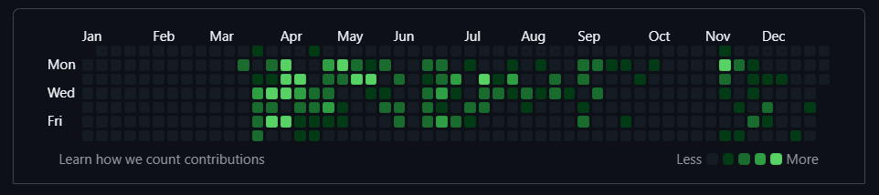

# Hey! 👋 Nice to see you.

  

  <h2>⚡ The Tech Arsenal</h2>
  
Architecting scalable solutions across the stack

   

  <h3>📱 Core Stack & Architecture</h3>
  
  
  
    

  

   
   

  <h3>🌐 Ecosystem & Infrastructure</h3>
  

---

## 🚀 Impact & Projects

| Project | Highlights | Tech Stack |
| :--- | :--- | :--- |
| **ZOOOX App** | Robust MIME email decoding & Gmail import via Google OAuth. | GraphQL, Apollo, SWR |
| **MockInMinutes** | AI Interview Assistant with voice-driven TTS/STT flows. | React Native, Groq AI |
| **ZOOOX Web** | Architected a Turborepo, reducing code duplication by 35%. | TypeScript, Monorepo |
| **Buckmint DEX** | Blockchain-based dashboard for trading and portfolios. | React, Redux, TS |

---

## 📊 Git Insights

  
  

 

  

---

  <h2>💼 Corporate Impact & Consistency</h2>
  
A snapshot of my daily commit history and consistent delivery on enterprise projects at Buckmint.

  
   

  

---

## 🌐 Get In Touch

---
> "Building the future, one commit at a time." 🚀
